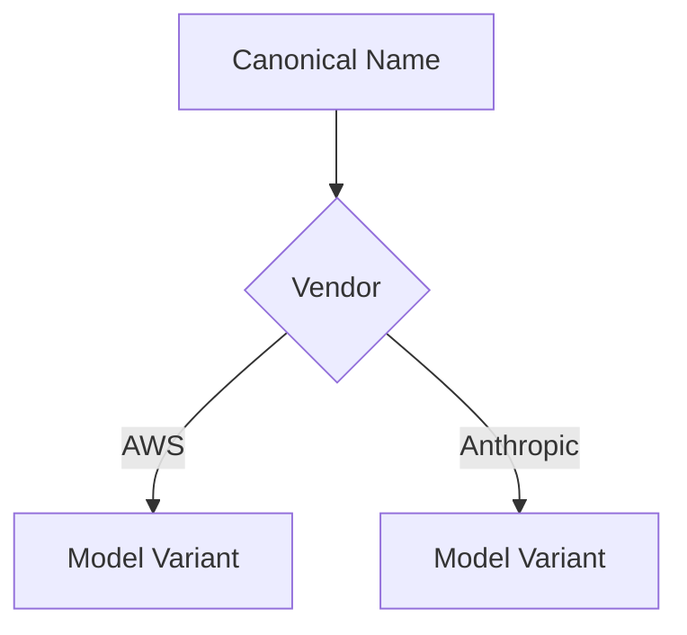

# Story of the Registry Redesign

---
## Why change the registry?
- Duplicate models from multiple vendors were overwriting each other
- Needed a way to keep them all without breaking existing code

---
## The new structure


---
## In simple terms
- **Kid:** We put models in little boxes for each vendor so none get lost.
- **High School:** A dictionary of dictionaries lets us track each vendor's version.
- **Academic:** `_models_by_vendor` prevents key collisions while `available_models` maintains backward compatibility.

---
## Usage example
```python
models = SupportedModels()
haiku = models.get_model("claude-3-haiku-20240307", Vendor.AWS)
```

---
## Benefits
- No silent overwrites
- Easy vendor-specific lookups
- Backwards compatible interface

---
